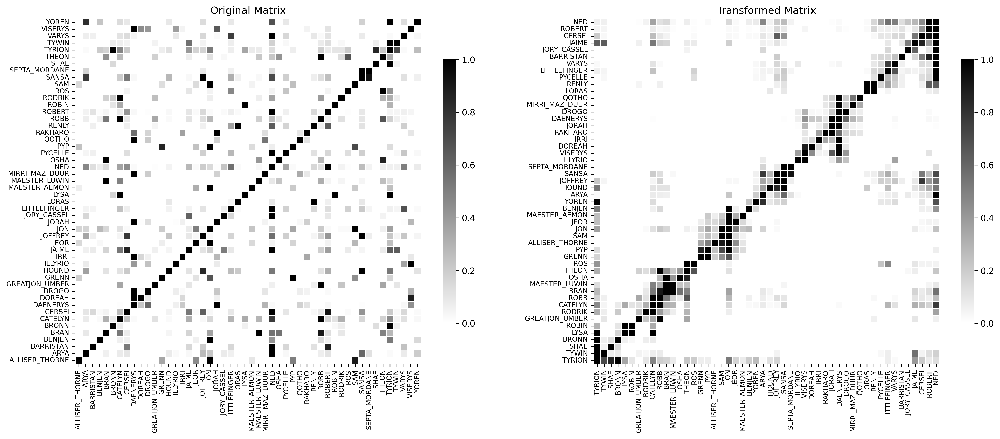
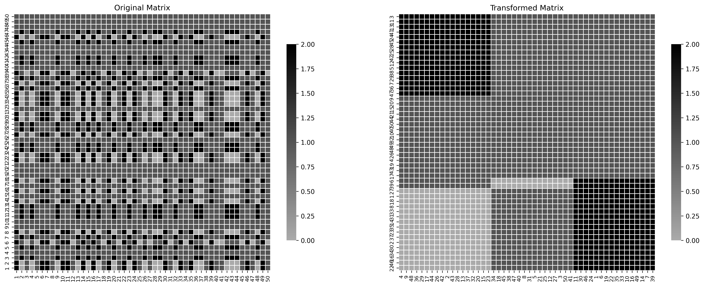

# Seriation via Mathematical Optimization

This repository contains code and experiments for solving matrix seriation problems using mathematical optimization techniques. Our focus is on exact formulations that optimize stress-based and efficiency-based objective functions, with applications in data visualization, pattern recognition, and cluster detection.

## Repository Contents

- `example_.ipynb`: Jupyter notebook illustrating usage and visualizations.
- `seriation_mathopt.py`: Core Python module implementing exact optimization models for matrix seriation.
- `got1_neumann.png`: Visualization of a real dataset (Game of Thrones co-occurrence) reordered using the Von Neumann stress model.
- `block_matrix.png`: Visualization of a synthetic block matrix reordered using our method.

## Problem Overview

Matrix seriation refers to the problem of finding a permutation of rows and/or columns of a matrix such that the reordered matrix reveals structure or clusters. This is particularly useful for heatmap visualization or detecting latent structure in similarity/dissimilarity data.

We tackle the seriation problem using exact mathematical optimization models:

- **Von Neumann Stress**
- **Moore Stress**
- **Measure of Efficiency (ME)**

These models are implemented as **Hamiltonian Path Problems** with customized cost matrices, and solved using MILP techniques with Gurobi.


## Datasets

The datasets are available in folder datasets.

## Example Visualizations

### Game of Thrones Character Matrix

<div align="center">
  
</div>

This shows a co-occurrence matrix for characters from the *Game of Thrones* series before and after seriation using the Von Neumann stress criterion.

### Synthetic Block Matrix

<div align="center">
  
</div>

The reordered matrix reveals distinct blocks of clustered entries, validating the effectiveness of the optimization-based reordering.


## Installation

No specific installation is required beyond standard Python libraries:

```bash
pip install numpy matplotlib seaborn


