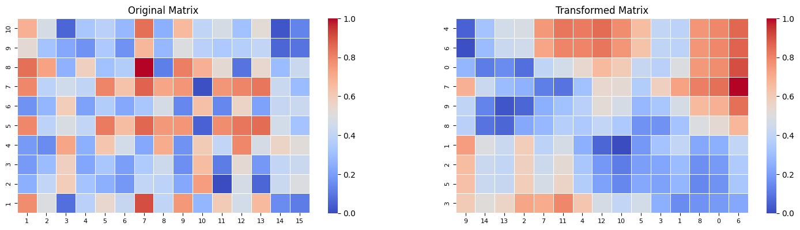

# Optimal Stress Seriation 

## Usage

**seriation_mathopt.py** contains all the functions to compute the optimal stress seriation with different methods.

In the class, _MatrixSeriation_, the parameters are set:

seriation = MatrixSeriation(matrix, file=file, method=method, symmetric_ordering=sym, eps_neigh=eps, output=output)

where:

    - _matrix_: is the matrix to be seriated
    - file (optional): name of the file (for the expriments to track the obtained results).
    - _method_: 
        * tsp: Hamiltonian path approaches.
        * spp: shortest path approaches
        * s: models based on the "s"-variables.
        * general: four index formulation (default)
    - _symmetric_ordering_; True: if both rows and columns are sorted with the same permutations; False: if rows and columns are differently permuted.
    - eps_neigh: 1 (Default): if the von Neumman neighbor is used, 1.5: is the Moore neighborhood is used for the stress seriation.
    - output: if the Gurobi outputflag information is printed while solving the problem (1) or not (0: default).

the function:

optimal_order = seriation.solve()

computes the re-arranged matrix with the optimal seriation (with the indicated parameters). The information can be extracted with _seriation_solver.ATTRIBUTE_ where ATTRIBUTE is one of the following:

    - nrows: number of rows of the matrix
    - ncols: number of columns of the matrix
    - order_rows: list of sorted rows with the optimal permutation
    - order_columns: list of sorted columns with the optimal permutation.
    - transformed_matrix: re-arranged matrix with the optimal permutations.

It is possible to extract extra information about the solution procedure by calling: seriation.solution_info. Specifically, apart from the above one obtains:

    - CPUTime
    - ObjectiveValue
    - MIPGap
    - LPRelaxation at Root
    - Work
    - NodeCount
    - Memory
    - NumBinVars
    - NumCtrs

Other information that can be computed is:

    - Homogeneity Original: seriation.Homogeneity(seriation.matrix)
    - Homogeneity Transformed: seriation.Homogeneity(seriation.transformed_matrix)
    - Error Original: seriation._compute_error(seriation.matrix)
    - Error Transformed: seriation._compute_error(seriation.transformed_matrix)

The heatmap matrices (original and transformed) are ploted with the following command: **seriation.plot_matrices**

Example:

```python
#A Random matrix generated
A = generate_nonsqr_instances(25, 15)
print(A)
```

```bash
array([[0.78, 0.25, 0.19, 0.19, 0.79, 0.17, 0.79, 0.84, 0.53, 0.69],
       [0.49, 0.41, 0.29, 0.15, 0.39, 0.27, 0.39, 0.73, 0.32, 0.47],
       [0.08, 0.59, 0.58, 0.72, 0.48, 0.59, 0.45, 0.26, 0.23, 0.06],
       [0.38, 0.32, 0.22, 0.25, 0.41, 0.21, 0.4 , 0.58, 0.17, 0.33],
       [0.54, 0.25, 0.33, 0.62, 0.82, 0.36, 0.8 , 0.31, 0.34, 0.38],
       [0.42, 0.18, 0.2 , 0.46, 0.65, 0.23, 0.63, 0.36, 0.17, 0.28],
       [0.91, 0.41, 0.35, 0.23, 0.86, 0.33, 0.87, 1.  , 0.67, 0.84],
       [0.4 , 0.39, 0.44, 0.7 , 0.75, 0.47, 0.72, 0.12, 0.28, 0.25],
       [0.75, 0.23, 0.16, 0.17, 0.76, 0.14, 0.76, 0.81, 0.49, 0.66],
       [0.27, 0.74, 0.65, 0.6 , 0.05, 0.64, 0.01, 0.69, 0.38, 0.4 ],
       [0.6 , 0.  , 0.11, 0.41, 0.78, 0.14, 0.76, 0.53, 0.34, 0.47],
       [0.46, 0.47, 0.53, 0.79, 0.83, 0.56, 0.8 , 0.09, 0.37, 0.31],
       [0.66, 0.06, 0.18, 0.47, 0.85, 0.21, 0.83, 0.54, 0.41, 0.52],
       [0.15, 0.43, 0.41, 0.56, 0.46, 0.42, 0.43, 0.29, 0.06, 0.02],
       [0.11, 0.49, 0.43, 0.51, 0.32, 0.43, 0.29, 0.43, 0.09, 0.13]])
```

```python
#The parameters for the problem are set:
seriation = MatrixSeriation(A, method="tsp", symmetric_ordering=False, eps_neigh=1, output=0)
```

```python
#The solver is called:
example = seriation.solve()
````

```python
#The solution can be extracted
print(seriation.solution_info)
````

```bash
{'file': 'test', 'Formulation': 'tsp', 'nrows': 15, 'ncols': 10, 'Sym': False, 'eps_neigh': 1, 'CPUTime': 0.03512096405029297, 'ObjectiveValue': 33.53, 'MIPGap': 0.0, 'LPRelaxation at Root': 0, 'Work': 0.02867217330746187, 'NodeCount': 1.0, 'Memory': 0.00179072, 'NumBinVars': 350, 'NumCtrs': 564, 'Order Rows': array([ 9, 14, 13,  2,  7, 11,  4, 12, 10,  5,  3,  1,  8,  0,  6]), 'Order Cols': array([3, 5, 2, 1, 8, 9, 7, 0, 6, 4])}
```

```python
#The transformed matrix can be extracted:
seriation.plot_matrices()
```




```python
#The transformed matrix can be extracted:
print(seriation.transformed_matrix)
```

```bash
array([[0.6 , 0.64, 0.65, 0.74, 0.38, 0.4 , 0.69, 0.27, 0.01, 0.05],
       [0.51, 0.43, 0.43, 0.49, 0.09, 0.13, 0.43, 0.11, 0.29, 0.32],
       [0.56, 0.42, 0.41, 0.43, 0.06, 0.02, 0.29, 0.15, 0.43, 0.46],
       [0.72, 0.59, 0.58, 0.59, 0.23, 0.06, 0.26, 0.08, 0.45, 0.48],
       [0.7 , 0.47, 0.44, 0.39, 0.28, 0.25, 0.12, 0.4 , 0.72, 0.75],
       [0.79, 0.56, 0.53, 0.47, 0.37, 0.31, 0.09, 0.46, 0.8 , 0.83],
       [0.62, 0.36, 0.33, 0.25, 0.34, 0.38, 0.31, 0.54, 0.8 , 0.82],
       [0.47, 0.21, 0.18, 0.06, 0.41, 0.52, 0.54, 0.66, 0.83, 0.85],
       [0.41, 0.14, 0.11, 0.  , 0.34, 0.47, 0.53, 0.6 , 0.76, 0.78],
       [0.46, 0.23, 0.2 , 0.18, 0.17, 0.28, 0.36, 0.42, 0.63, 0.65],
       [0.25, 0.21, 0.22, 0.32, 0.17, 0.33, 0.58, 0.38, 0.4 , 0.41],
       [0.15, 0.27, 0.29, 0.41, 0.32, 0.47, 0.73, 0.49, 0.39, 0.39],
       [0.17, 0.14, 0.16, 0.23, 0.49, 0.66, 0.81, 0.75, 0.76, 0.76],
       [0.19, 0.17, 0.19, 0.25, 0.53, 0.69, 0.84, 0.78, 0.79, 0.79],
       [0.23, 0.33, 0.35, 0.41, 0.67, 0.84, 1.  , 0.91, 0.87, 0.86]])
```


## Instances:

- *easy* instances: square matrices nxn designed to contain structures that facilitate ordering. To generate them, we draw $n$ points in [0,100] and output their distance matrix (pairwise absolute differences). Folder *easy_instances*. Five random instances for each n in [10,20,30,40,50,100].
- structured *square* instances: Square matrices (nxn) but contain more complex structured patterns. They are generated also as pairwise Euclidean distances between randomly generated points in [0,100]x [0,100]. Folder *easy_instances*.
- *nonsquare* instances: For n > m, we generate rectangular matrices (nxm) created with structured patterns that introduce complexity in ordering tasks. They are generated also as pairwise Euclidean distances between two sets of (n and m) randomly generated points in [0,100]x [0,100]. Folder *nonsqr_instances*.
- *binary square* instances: We randomly generate binary square instances (nxn), but with certain densities (percent of elements that are 1 in th whole matrix). We chose densities d in {25%,50%,75%}. Folder *bin_instances* with pattern *bin{d}\_{n}\_instance.txt*.
- *binary nonsquare* instances: Rectangular matrices (n x m) and contain only binary values, and with the same density parameters than the binary square instances.